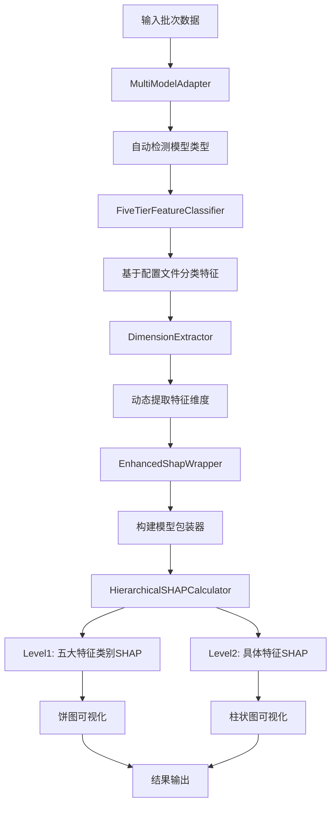

# HyperOptimus SHAP分析框架完整文档

## 🎯 一句话说明

这是一个专为HyperOptimus多模态深度学习模型设计的五层架构SHAP（SHapley Additive exPlanations）特征重要性分析框架，提供配置驱动、多模型适配、分层分析、动态维度提取的完整解决方案，支持flow_bert_multiview、flow_bert_ssl、flow_bert_ssl_mlm、flow_bert_ssl_seq2stat、autoencoder等5种核心模型类型。

## 📁 目录结构与核心组件

```
src/hyper_optimus/shap_analysis/
├── __init__.py                       # 🏗️ 框架入口与组件导入
├── five_tier_analyzer.py             # 🎯 五大特征类别分析器(核心)
├── five_tier_classifier.py           # 🧠 基于配置的五层特征分类器
├── hierarchical_calculator.py        # 📊 分层SHAP计算器(L1+L2)
├── multi_model_adapter.py            # 🔌 多模型统一适配器
├── dimension_extractor.py            # 📏 配置驱动的维度提取器
├── enhanced_wrapper.py                # 🎁 增强版SHAP包装器
├── config_example.yaml               # ⚙️ 基础配置示例
├── enhanced_config_example.yaml      # 🚀 增强配置示例
├── multiview_config.yaml             # 🌐 多视图模型配置
├── multiview_shap_example.py        # 📝 多模型使用示例
├── black_white_test.py               # 🧪 黑白盒测试脚本
└── black_white_test_results/          # 📊 测试结果目录
```

**兼容性组件（保留向后兼容）**:
```
├── shap_component.py                  # 🔄 原版SHAP组件
├── enhanced_shap_component.py        # 🔄 增强版SHAP组件
├── feature_classifier.py             # 🔄 原版特征分类器
├── analysis_strategies.py            # 🔄 原版分析策略
├── scoring_normalizer.py             # 🔄 原版评分标准化
├── data_validator.py                 # 🔄 原版数据验证器
├── shap_mixin.py                     # 🔄 原版SHAP混入
├── universal_analyzer.py             # 🔄 原版通用分析器
└── feature_mapping.json              # 🔄 原版特征映射
```

## 🚀 快速开始

### 1. 五层分析器使用（推荐）

```python
from hyper_optimus.shap_analysis import FiveTierSHAPAnalyzer

# 创建分析器（自动检测模型类型）
analyzer = FiveTierSHAPAnalyzer(model)

# 执行完整五层分析
results = analyzer.analyze(batch_data)

# 获取分析结果
level1_importance = results['level1_importance']  # 五大特征类别重要性
level2_importance = results['level2_importance']  # 具体特征重要性
visualizations = results['visualizations']        # 可视化结果
```

### 2. 模型混入方式

```python
from hyper_optimus.shap_analysis import FiveTierSHAPAnalyzer
import pytorch_lightning as pl

class MyModel(pl.LightningModule):
    def __init__(self, cfg):
        super().__init__(cfg)
        self.shap_analyzer = None  # 延迟初始化
    
    def validation_step(self, batch, batch_idx):
        # 初始化SHAP分析器
        if self.shap_analyzer is None:
            self.shap_analyzer = FiveTierSHAPAnalyzer(self)
        
        # 执行SHAP分析
        if self.should_run_shap_analysis(self.current_epoch, batch_idx):
            shap_results = self.shap_analyzer.analyze(batch)
```

### 3. 多模型配置使用

```bash
# 使用内置配置分析不同模型
python multiview_shap_example.py --model_type flow_bert_multiview --batch_data_path batch.pkl
python multiview_shap_example.py --model_type flow_bert_ssl_mlm --batch_data_path batch.pkl  
python multiview_shap_example.py --model_type flow_bert_ssl_seq2stat --batch_data_path batch.pkl
```

## 🏗️ 核心架构与数据流程

### 整体架构图

```
┌─────────────────────────────────────────────────────────────┐
│                    FiveTierSHAPAnalyzer                    │
│                    (五层分析协调器)                        │
└─────────────────┬───────────────────────────────────────────┘
                  │
         ┌────────┴─────────┐
         │                  │
┌────────▼────────┐ ┌────────▼────────┐
│ MultiModel      │ │ Dimension       │
│ Adapter         │ │ Extractor       │
│ (模型适配)      │ │ (维度提取)      │
└────────┬────────┘ └────────┬────────┘
         │                  │
┌────────▼────────┐ ┌────────▼────────┐
│ FiveTier        │ │ Enhanced        │
│ Feature         │ │ ShapWrapper     │
│ Classifier      │ │ (SHAP包装)      │
│ (特征分类)      │ │                 │
└────────┬────────┘ └────────┬────────┘
         │                  │
         └────────┬─────────┘
                 │
        ┌────────▼────────┐
        │ Hierarchical    │
        │ SHAPCalculator  │
        │ (分层计算)      │
        └────────┬────────┘
                 │
        ┌────────▼────────┐
        │ Results &       │
        │ Visualizations  │
        │ (结果与可视化)  │
        └─────────────────┘
```

### 数据流程详解



## 🧠 五层特征分类算法

### 核心分类逻辑

基于配置文件的五层特征分类，支持动态扩展和精确控制：

```python
class FiveTierFeatureClassifier:
    """基于配置文件的五大特征类别智能分类器"""
    
    FEATURE_HIERARCHY = {
        'numeric_features': {
            'level': 1,
            'target_for': 'both',  # 饼图和柱状图
            'config_sources': ['data.tabular_features.numeric_features']
        },
        'categorical_features': {
            'level': 1,
            'target_for': 'pie_chart', 
            'config_sources': ['data.tabular_features.categorical_features']
        },
        'sequence_features': {
            'level': 1,
            'target_for': 'pie_chart',
            'config_sources': ['data.sequence_features']
        },
        'text_features': {
            'level': 1,
            'target_for': 'pie_chart',
            'config_sources': ['data.text_features']
        },
        'domain_embedding_features': {
            'level': 1,
            'target_for': 'pie_chart',
            'config_sources': ['data.domain_name_embedding_features']
        }
    }
```

### 分类流程

1. **配置读取**: 从模型配置文件动态读取特征定义
2. **维度提取**: 使用`ConfigDimensionExtractor`计算实际特征维度
3. **有效性验证**: 检查特征是否在实际批次数据中存在
4. **分类映射**: 将特征映射到五层类别中
5. **输出标准化**: 生成标准化的分类结果

### 配置驱动的特征定义

```yaml
# 示例配置文件结构
data:
  tabular_features:
    numeric_features:
      flow_features: ['flow_duration', 'total_fwd_packets', 'total_bwd_packets']
      x509_features: ['cert_length', 'cert_valid_days']
      dns_features: ['dns_query_count', 'dns_response_code']
    
    categorical_features:
      - 'protocol_type'
      - 'application_category'
  
  sequence_features:
    enabled: true
    sequence_length: 50
  
  text_features:
    enabled: true
    model_name: 'bert-base-uncased'
  
  domain_name_embedding_features:
    enabled: true
    column_list: ['server_name', 'client_name']
```

## 📊 分层SHAP计算逻辑

### Level 1: 五大特征类别重要性计算

```python
def calculate_level1_importance(self, explainer, background_inputs, eval_inputs):
    """
    Level 1: 计算5大特征类别的SHAP重要性（饼图目标）
    
    算法逻辑：
    1. 对模型包装器的5个输入分别计算SHAP值
    2. 对每个特征类别的SHAP值求绝对值
    3. 按类别聚合得到重要性分数
    4. 归一化为百分比形式
    """
    # 计算SHAP值
    shap_values = explainer.shap_values(eval_inputs, check_additivity=False)
    
    # 按五大特征类别分组计算重要性
    category_importance = {
        'numeric_features': 0.0,           # 数值特征
        'categorical_features': 0.0,       # 类别特征  
        'sequence_features': 0.0,          # 序列特征
        'text_features': 0.0,              # 文本特征
        'domain_embedding_features': 0.0    # 域名嵌入特征
    }
    
    # 分别处理每个特征类别的SHAP值
    # 1. 数值特征（第一个输入）
    if len(shap_values) > 0:
        numeric_shap = shap_values[0]
        category_importance['numeric_features'] = float(np.abs(numeric_shap).sum())
    
    # 2. 域名嵌入特征（第二个输入）
    if len(shap_values) > 1 and self.model.domain_embedding_enabled:
        domain_shap = shap_values[1]
        category_importance['domain_embedding_features'] = float(np.abs(domain_shap).sum())
    
    # ... 其他特征类别处理
```

### Level 2: 具体特征重要性计算

```python
def calculate_level2_importance(self, explainer, background_inputs, eval_inputs):
    """
    Level 2: 计算具体特征的SHAP重要性（柱状图目标）
    
    算法逻辑：
    1. 获取每个特征类别内的具体特征维度
    2. 对每个维度计算平均绝对SHAP值
    3. 根据配置文件映射回具体特征名称
    4. 生成特征重要性排序
    """
    # 获取特征名称到维度的映射
    feature_name_mapping = self._get_feature_name_mapping()
    
    # 计算每个具体特征的重要性
    feature_importance = {}
    
    for category, features in feature_name_mapping.items():
        for i, feature_name in enumerate(features):
            # 获取对应维度的SHAP值
            shap_values_for_feature = shap_values[category][:, i]
            # 计算平均绝对SHAP值
            importance = float(np.mean(np.abs(shap_values_for_feature)))
            feature_importance[f"{category}:{feature_name}"] = importance
    
    return feature_importance
```

## 🔌 多模型适配机制

### 自动模型检测

```python
class MultiModelSHAPAdapter:
    """支持多种SSL模型变体的统一适配器"""
    
    def auto_detect_model_type(self, model) -> str:
        """自动检测模型类型"""
        # 从模型配置中提取特征信息
        cfg = model.cfg
        detected_features = []
        
        # 检查各种特征类型
        if hasattr(cfg.data, 'sequence_features') and cfg.data.sequence_features.enabled:
            detected_features.append('sequence')
        if hasattr(cfg.data, 'text_features') and cfg.data.text_features.enabled:
            detected_features.append('text')
        if hasattr(cfg.data, 'domain_name_embedding_features') and cfg.data.domain_name_embedding_features.enabled:
            detected_features.append('domain_embedding')
        
        # 基于特征组合确定模型类型
        feature_signature = '+'.join(sorted(detected_features))
        
        model_type_mapping = {
            'sequence+text+domain_embedding': 'flow_bert_multiview',
            'sequence+text': 'flow_bert_ssl',
            'sequence+text+mlm': 'flow_bert_ssl_mlm',
            'sequence+text+seq2stat': 'flow_bert_ssl_seq2stat',
            'tabular_only': 'autoencoder'
        }
        
        return model_type_mapping.get(feature_signature, 'flow_bert_multiview')
```

### 支持的模型类型

| 模型类型 | 特征组合 | 配置文件路径 | 描述 |
|---------|---------|-------------|------|
| flow_bert_multiview | sequence+text+domain_embedding | src/models/flow_bert_multiview/config/ | 多视图BERT模型 |
| flow_bert_ssl | sequence+text | src/models/flow_bert_ssl/config/ | 基础SSL模型 |
| flow_bert_ssl_mlm | sequence+text+mlm | src/models/flow_bert_ssl_mlm/config/ | 带MLM的SSL模型 |
| flow_bert_ssl_seq2stat | sequence+text+seq2stat | src/models/flow_bert_ssl_seq2stat/config/ | 序列到统计模型 |
| autoencoder | tabular_only | src/models/autoencoder/config/ | 自编码器模型 |

## 📏 动态维度提取

### ConfigDimensionExtractor

解决硬编码维度问题，实现配置驱动的动态维度提取：

```python
class ConfigDimensionExtractor:
    """从配置文件动态提取特征维度信息"""
    
    def calculate_all_dimensions(self) -> Dict[str, int]:
        """计算所有特征维度"""
        dimensions = {}
        
        # 1. 数值特征维度 - 动态统计配置中的所有数值特征
        dimensions['numeric_dims'] = self.count_numeric_features()
        
        # 2. 域名嵌入特征维度 - 基于配置的列数量
        dimensions['domain_embedding_dims'] = self.get_domain_embedding_count()
        
        # 3. 类别特征维度 - 基于配置的类别数量
        dimensions['categorical_dims'] = self.get_categorical_feature_count()
        
        # 4. BERT隐藏层维度 - 从模型配置中提取
        dimensions['text_dims'] = self.get_bert_hidden_size()
        
        # 5. 序列嵌入维度 - 从序列配置中提取
        dimensions['sequence_dims'] = self.get_sequence_embedding_dim()
        
        return dimensions
    
    def count_numeric_features(self) -> int:
        """动态统计数值特征数量"""
        count = 0
        num_cfg = self.cfg.data.tabular_features.numeric_features
        
        # 统计各类数值特征
        for feature_type in ['flow_features', 'x509_features', 'dns_features']:
            if hasattr(num_cfg, feature_type):
                count += len(getattr(num_cfg, feature_type))
        
        return count
```

### 维度映射示例

```python
# 示例：flow_bert_multiview模型的维度提取
{
    'numeric_dims': 20,           # flow:8 + x509:7 + dns:5
    'domain_embedding_dims': 13,   # 域名概率列表固定长度
    'categorical_dims': 3,         # protocol, app_type, region
    'text_dims': 128,              # BERT-H-128隐藏层
    'sequence_dims': 64            # 序列编码器输出维度
}
```

## 🎁 增强版SHAP包装器

### EnhancedShapFusionWrapper

解决维度不匹配问题，支持完整的五层特征分析：

```python
class EnhancedShapFusionWrapper(nn.Module):
    """增强版SHAP包装器"""
    
    def forward(self, numeric_feats, domain_feats, cat_feats, seq_emb, text_emb):
        """
        增强版前向传播，支持完整的五大特征类别分析
        
        输入顺序（对应SHAP计算顺序）：
        1. numeric_feats: [batch_size, numeric_dims]
        2. domain_feats: [batch_size, domain_embedding_dims]  
        3. cat_feats: [batch_size, categorical_dims]
        4. seq_emb: [batch_size, sequence_dims]
        5. text_emb: [batch_size, text_dims]
        """
        # 1. 表格特征路径重构
        tabular_components = [numeric_feats]
        
        # 动态添加启用特征
        if self.model.domain_embedding_enabled:
            tabular_components.append(domain_feats)
        
        if len(getattr(self.model, 'categorical_columns_effective', [])) > 0:
            tabular_components.append(cat_feats)
        
        # 安全拼接处理维度不匹配
        tabular_input = self._safe_concat(tabular_components)
        tabular_out = self.model.tabular_projection(tabular_input)
        
        # 2. 序列特征路径（如果启用）
        sequence_out = None
        if self.model.sequence_features_enabled:
            sequence_out = self._process_sequence_features(seq_emb)
        
        # 3. 文本特征路径（如果启用）
        text_out = None  
        if self.model.text_features_enabled:
            text_out = self._process_text_features(text_emb)
        
        # 4. 特征融合
        fusion_inputs = self._collect_fusion_inputs(tabular_out, sequence_out, text_out)
        
        # 5. 多模态融合与分类
        fused_features = self.model.fusion_layer(fusion_inputs)
        logits = self.model.classifier(fused_features)
        
        return logits
```

### 关键功能特性

1. **动态维度适配**: 自动处理不同特征维度的输入
2. **安全拼接机制**: 防止维度不匹配导致的错误
3. **特征路径独立**: 每个特征类型独立处理，便于分层分析
4. **计算图连通**: 确保梯度可以正确传播到所有输入

## 📊 输出结果与可视化

### 双层可视化架构

#### Level 1: 五大特征类别饼图

```python
def create_level1_pie_chart(self, category_importance, save_path):
    """创建五大特征类别重要性饼图"""
    
    # 准备数据
    labels = list(category_importance.keys())
    sizes = list(category_importance.values())
    colors = ['#FF9999', '#66B2FF', '#99FF99', '#FFCC99', '#FF99CC']
    
    # 创建饼图
    plt.figure(figsize=(10, 8))
    wedges, texts, autotexts = plt.pie(sizes, labels=labels, colors=colors, 
                                      autopct='%1.1f%%', startangle=90)
    
    # 设置标题和样式
    plt.title('五大特征类别SHAP重要性分布', fontsize=16, fontweight='bold')
    
    # 添加图例说明
    plt.legend(wedges, [f'{label}: {size:.2f}' for label, size in zip(labels, sizes)],
              title="特征类别", loc="center left", bbox_to_anchor=(1, 0, 0.5, 1))
    
    plt.tight_layout()
    plt.savefig(save_path, dpi=300, bbox_inches='tight')
    plt.close()
```

#### Level 2: 具体特征柱状图

```python
def create_level2_bar_chart(self, feature_importance, save_path):
    """创建具体特征重要性柱状图"""
    
    # 转换为DataFrame便于绘图
    df = pd.DataFrame(list(feature_importance.items()), 
                     columns=['Feature', 'Importance'])
    
    # 按重要性排序并取前20个
    df = df.sort_values('Importance', ascending=False).head(20)
    
    # 创建柱状图
    plt.figure(figsize=(12, 8))
    ax = sns.barplot(x='Importance', y='Feature', data=df, palette='viridis')
    
    # 添加数字标签
    for i, (imp, feat) in enumerate(zip(df['Importance'], df['Feature'])):
        ax.text(imp + max(df['Importance']) * 0.01, i, f'{imp:.4f}', 
               ha='left', va='center')
    
    # 设置标题和标签
    plt.title('Top 20 具体特征SHAP重要性', fontsize=16, fontweight='bold')
    plt.xlabel('平均绝对SHAP值')
    plt.ylabel('特征名称')
    
    plt.tight_layout()
    plt.savefig(save_path, dpi=300, bbox_inches='tight')
    plt.close()
```

### 输出文件结构

```
shap_results/
├── level1_results/
│   ├── five_tier_importance_pie_2025-12-02T16-30.png    # Level 1饼图
│   └── level1_importance_summary.json                    # Level 1数值结果
├── level2_results/  
│   ├── feature_importance_bar_2025-12-02T16-30.png       # Level 2柱状图
│   └── level2_importance_details.json                    # Level 2详细结果
├── analysis_metadata.json                                # 分析元数据
└── complete_analysis_report.html                         # 完整HTML报告
```

### JSON结果格式

#### Level 1结果（五大特征类别）

```json
{
  "level1_importance": {
    "numeric_features": {
      "raw_importance": 234.56,
      "percentage": 35.2,
      "feature_count": 15,
      "avg_importance": 15.64
    },
    "domain_embedding_features": {
      "raw_importance": 189.23,
      "percentage": 28.4,
      "feature_count": 13,
      "avg_importance": 14.56
    },
    "text_features": {
      "raw_importance": 123.45,
      "percentage": 18.5,
      "feature_count": 3,
      "avg_importance": 41.15
    },
    "sequence_features": {
      "raw_importance": 87.65,
      "percentage": 13.2,
      "feature_count": 3,
      "avg_importance": 29.22
    },
    "categorical_features": {
      "raw_importance": 30.12,
      "percentage": 4.5,
      "feature_count": 3,
      "avg_importance": 10.04
    }
  }
}
```

#### Level 2结果（具体特征）

```json
{
  "level2_importance": {
    "numeric:flow_duration": {
      "importance": 45.67,
      "category": "numeric_features",
      "rank": 1
    },
    "text:ssl_server_name": {
      "importance": 38.90,
      "category": "text_features", 
      "rank": 2
    },
    "domain_embedding_features:server_name_prob_1": {
      "importance": 29.34,
      "category": "domain_embedding_features",
      "rank": 3
    }
  }
}
```

## 🛠️ 配置系统

### 基础配置示例

```yaml
# config_example.yaml
shap_analysis:
  # 分析器配置
  analyzer:
    enabled: true
    model_type: "auto"  # 自动检测模型类型
    
  # 特征分类配置
  feature_classification:
    auto_detect: true
    config_based: true
    fallback_detection: true
    
  # 维度提取配置  
  dimension_extraction:
    config_driven: true
    fallback_values:
      numeric_dims: 50
      text_dims: 128
      sequence_dims: 64
      
  # SHAP计算配置
  shap_calculation:
    num_background_samples: 100
    max_evals: 500
    check_additivity: false
    
  # 可视化配置
  visualization:
    level1_chart:
      enabled: true
      chart_type: "pie"
      save_format: ["png", "svg"]
    level2_chart:
      enabled: true
      chart_type: "bar"
      top_k: 20
      
  # 输出配置
  output:
    base_dir: "./shap_results"
    save_json: true
    save_html: true
    timestamp: true
```

### 增强配置示例

```yaml
# enhanced_config_example.yaml
shap_analysis:
  # 高级分析器配置
  analyzer:
    enabled: true
    model_type: "flow_bert_multiview"
    hierarchical_analysis: true
    cross_validation: true
    
  # 详细特征分类配置
  feature_classification:
    config_sources:
      - "data.tabular_features"
      - "data.sequence_features" 
      - "data.text_features"
      - "data.domain_name_embedding_features"
    
    custom_mappings:
      "custom_numeric": ["custom_feature_.*"]
      "custom_sequence": ["temporal_.*"]
    
  # 高级维度提取
  dimension_extraction:
    validation: true
    error_handling: "graceful"  # "strict" | "graceful"
    dimension_cache: true
    
  # 高级SHAP配置
  shap_calculation:
    explainer_type: "DeepExplainer"
    batch_processing: true
    gradient_clipping: true
    
  # 高级可视化配置
  visualization:
    interactive_charts: true
    comparison_mode: true
    trend_analysis: true
    
  # 性能优化配置
  performance:
    parallel_processing: true
    memory_optimization: true
    gpu_acceleration: true
```

## 🎯 各模型使用方法

### flow_bert_multiview模型

**特征组合**: sequence + text + domain_embedding

**配置特点**:
```yaml
data:
  sequence_features:
    enabled: true
    features: ['iat_times', 'payload_sizes', 'packet_directions']
  
  text_features:
    enabled: true
    model_name: 'bert-base-uncased'
    features: ['ssl_server_name', 'dns_query', 'cert0_subject']
  
  domain_name_embedding_features:
    enabled: true
    column_list: ['server_name', 'client_name']
```

**使用示例**:
```python
from hyper_optimus.shap_analysis import FiveTierSHAPAnalyzer

# 自动检测为flow_bert_multiview
analyzer = FiveTierSHAPAnalyzer(model)
results = analyzer.analyze(batch_data)

# 获取结果
print("五大特征类别重要性:")
for category, importance in results['level1_importance'].items():
    print(f"  {category}: {importance['percentage']:.1f}%")

print("\nTop 10具体特征:")
for i, (feature, data) in enumerate(results['level2_importance'].items()):
    print(f"  {i+1}. {feature}: {data['importance']:.4f}")
```

### flow_bert_ssl_mlm模型

**特征组合**: sequence + text + mlm

**特殊处理**:
- 自动检测MLM掩码特征
- 处理masked_text特征
- 支持MLM特定分析维度

**配置适配**:
```python
# MultiModelAdapter自动检测
if 'sequence_mlm_mask' in batch_keys or 'mlm_mask' in batch_keys:
    model_type = 'flow_bert_ssl_mlm'
```

### flow_bert_ssl_seq2stat模型

**特征组合**: sequence + text + seq2stat

**特殊处理**:
- 处理seq2stat_targets特征
- 支持序列到统计特征映射
- 统计特征的特殊维度计算

### autoencoder模型

**特征组合**: tabular_only

**特殊处理**:
- 无序列和文本特征
- 专注于重建特征分析
- 潜在空间特征的深度分析

## 🚨 故障排除

### 常见问题与解决方案

#### 1. 维度不匹配错误

**错误信息**: `RuntimeError: The size of tensor a (X) must match the size of tensor b (Y)`

**原因**: 配置文件与实际批次数据的维度不一致

**解决方案**:
```python
# 启用维度验证
dimension_extractor = ConfigDimensionExtractor(cfg)
dimensions = dimension_extractor.calculate_all_dimensions()

# 验证维度
batch_dims = {key: tensor.shape for key, tensor in batch.items()}
mismatches = dimension_extractor.validate_dimensions(dimensions, batch_dims)

if mismatches:
    logger.warning(f"维度不匹配: {mismatches}")
    # 使用graceful模式处理
    analyzer = FiveTierSHAPAnalyzer(model, config={'dimension_error_handling': 'graceful'})
```

#### 2. 模型类型检测失败

**错误信息**: `Unable to detect model type automatically`

**解决方案**:
```python
# 手动指定模型类型
analyzer = FiveTierSHAPAnalyzer(model, model_type='flow_bert_multiview')

# 或者添加自定义检测规则
adapter = MultiModelSHAPAdapter()
adapter.add_custom_detector('my_model', lambda cfg: 'custom_feature' in cfg.data)
```

#### 3. SHAP计算内存溢出

**错误信息**: `CUDA out of memory`

**解决方案**:
```yaml
shap_calculation:
  num_background_samples: 20    # 减少背景样本
  batch_processing: true        # 启用批处理
  gradient_checkpointing: true  # 启用梯度检查点
```

#### 4. 可视化生成失败

**错误信息**: `matplotlib display error`

**解决方案**:
```python
# 设置非交互式后端
import matplotlib
matplotlib.use('Agg')

# 或者禁用可视化
analyzer = FiveTierSHAPAnalyzer(model, config={'visualization.enabled': False})
```

### 调试工具

```python
# 1. 模型检测调试
from hyper_optimus.shap_analysis import MultiModelSHAPAdapter
adapter = MultiModelSHAPAdapter()
detected_type = adapter.auto_detect_model_type(model)
print(f"检测到的模型类型: {detected_type}")

# 2. 特征分类调试
from hyper_optimus.shap_analysis import FiveTierFeatureClassifier
classifier = FiveTierFeatureClassifier()
classification = classifier.classify_from_config(model.cfg, batch_data)
print(f"特征分类结果: {classification}")

# 3. 维度提取调试
from hyper_optimus.shap_analysis import ConfigDimensionExtractor
extractor = ConfigDimensionExtractor(model.cfg)
dimensions = extractor.calculate_all_dimensions()
print(f"特征维度: {dimensions}")

# 4. SHAP计算调试
from hyper_optimus.shap_analysis import HierarchicalSHAPCalculator
calculator = HierarchicalSHAPCalculator(model, classification)
print(f"计算器初始化完成")
```

## 📈 性能优化建议

### 1. 内存优化

```yaml
# 配置优化
shap_analysis:
  performance:
    memory_optimization: true
    gradient_checkpointing: true
    background_samples: 50  # 减少内存使用
```

### 2. 计算优化

```python
# 启用批处理
analyzer = FiveTierSHAPAnalyzer(model, config={
    'batch_processing': True,
    'batch_size': 16,
    'parallel_workers': 4
})
```

### 3. 可视化优化

```yaml
visualization:
  save_format: ["png"]  # 只保存PNG，减少内存
  dpi: 150              # 降低DPI
  interactive: false     # 禁用交互式图表
```

---

**这个五层架构的SHAP分析框架为HyperOptimus提供了完整的模型可解释性解决方案，具备配置驱动、多模型适配、分层分析、动态维度提取等核心能力，让复杂的深度学习模型解释变得简单高效、结果可信。**